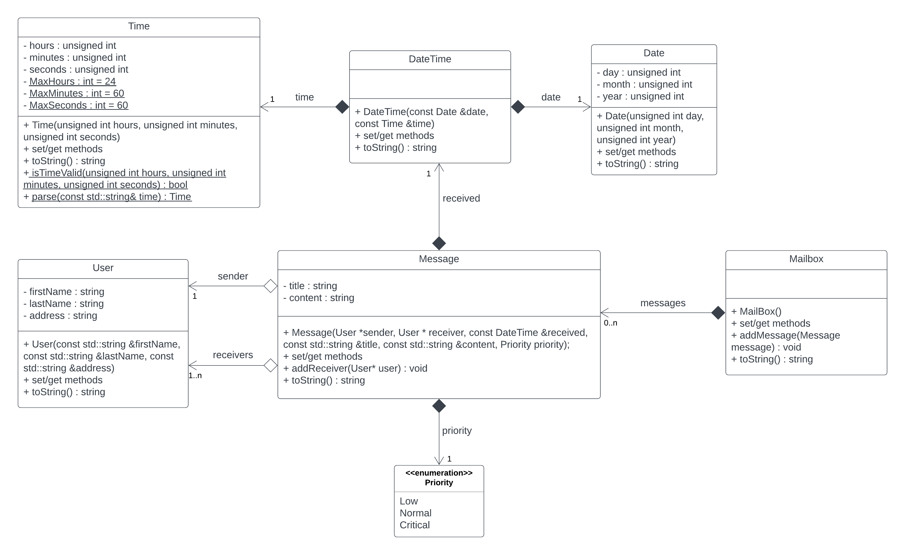

# Task 4.2 (optional)

Take the `Time` class from Task 4.1. In addition, the `Date` and `DateTime` classes are attached (already
implemented).

Complete the task with the classes defined in the UML diagram.

_When solving the task, take into account all the knowledge acquired so far (use of the initialization list, constants
methods, write down the get/set methods where you need them, etc.)._

