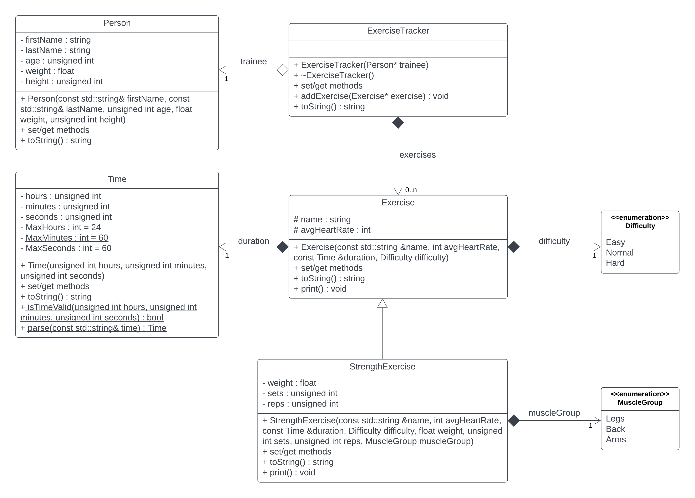

# Task 5.1 (mandatory)

* Take task 4.1.
* Modify the `ExerciseTracker` class so that instance variable `exercises` is of type `vector<Exercise*>` (composition).
* Add a `StrengthExercise` class that inherits from the `Exercise` class.
* The main function should have an `ExerciseTracker` object and add to `exercises`:
  * 3 examples of `Exercise` and
  * 2 examples of `StrengthExercise`.

Some guidance on solving the problem:

* Beware of using `protected`, `virtual`, and `override`.

_When solving the task, take into account all the knowledge acquired so far (use of the initialization list, constant
methods, write down the get/set methods where you need them, etc.)._
