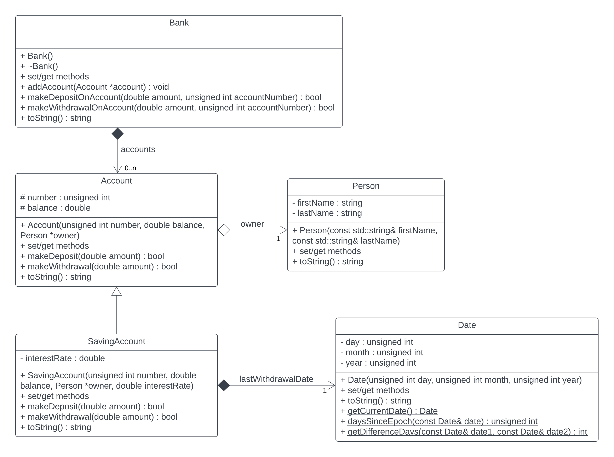

# Task 5.2 (optional)

The `Date` class is attached.

Implement the task with the classes defined in the UML diagram.

Additional explanation for `Account`:
* the `makeDeposit` method adds the value in the account state - in case it is a negative value the method should return `false` (since a withdrawal would occur)
* the `makeWithdrawal` method subtracts the value in the account balance - if the value is negative, the method should return `false` (since there would be a deposit)

Additional explanation for `Savings Account`:
* in the constructor, the `lastWithdrawalDate` should be set to 0. 0. 0 (i.e. no withdrawal has occurred yet)
* the `makeDeposit` method should multiply the amount by the interest rate when making a deposit
* the `makeWithdrawal` method should only deduct the value if 90 days have passed since the last withdrawal

_When solving the problem, take into account all the knowledge acquired so far (use of the initialization list, constant method,
write down get/set methods where you need them, etc.)._