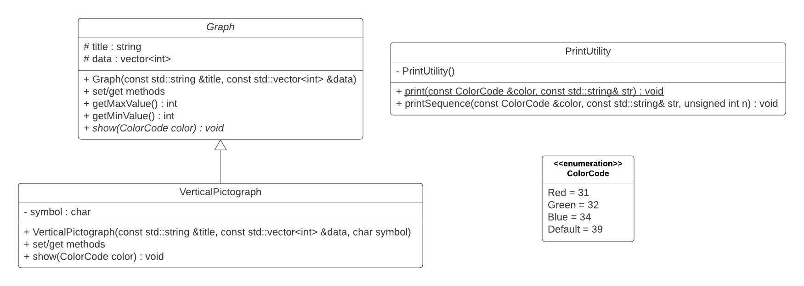
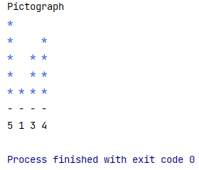

# Task 6.1 (mandatory)

* The `PrintUtility` class is attached. The class will allow you to print colored text in the console. However, for this to work, you need to add a line to the beginning of the `main` function:
```c++
using namespace std::string_literals; 
system(("chcp "s + std::to_string(65001)).c_str());
```
*It is possible that if you use another program (something other than CLion), this functionality will not work.*
* Write the other classes as specified in the UML diagram.



* Create at least four diagrams in the main program.

When solving the task, take into account all the knowledge you have acquired so far (use initialization list, constant methods, write down get/set methods where you need them, etc.).

* Example of a printout of the main program.
```c++
int main() {
    using namespace std::string_literals;
    system(("chcp "s + std::to_string(65001)).c_str());

    VerticalPictograph vp('Pictograph', std::vector<int>{5, 1, 3, 4}, '*');
    vp.show(ColorCode::Blue);

    return 0;
}
```
