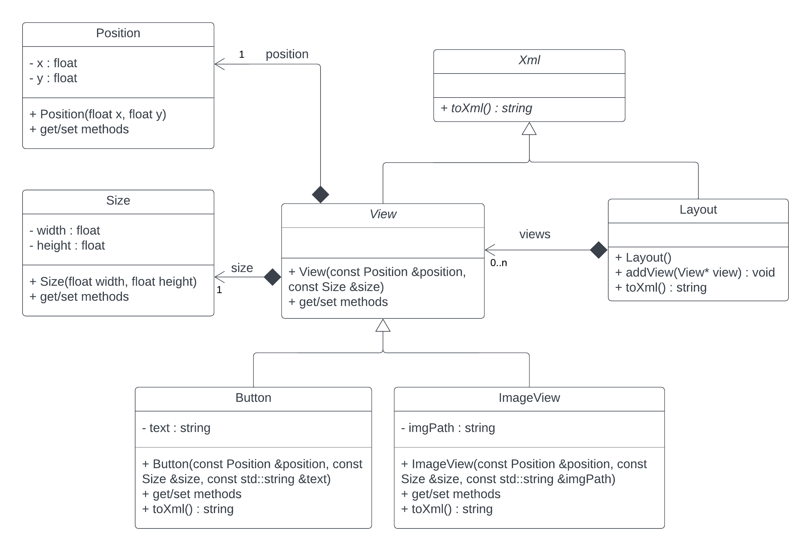

# Task 6.2 (optional)

Write the classes as defined in the UML diagram.



Example of program output when calling the `toXml()` method on an instance of the `Layout` object:
```
<Layout>
        <Button
                width="10px"
                height="2px"
                text="Lorem Ipsum is simply dummy text of the printing and typesetting industry."
                visible="true" />
        <ImageView
                width="10px"
                height="2px"
                imgPath="C:\Users\Prog2\Images\img2.png"
                visible="true" />
</Layout>

```