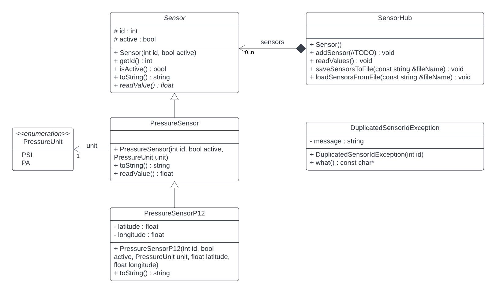

# Task 11.1 (mandatory)

Implement the classes as defined in the UML diagram.



1. Additional explanation:
    * The `readValue` method returns a random float value.
    * The `readValues` method prints the values of the sensors (i.e. calls the readValue method) that are active. It
      displays the sensor and its value.
    * In the `SensorHub` class you must
      use [smart pointers from the C++11 standard](https://en.cppreference.com/w/cpp/memory/shared_ptr). Consider what
      should be passed to the addSensor method (where //TODO is in the UML diagram).
    * The exception `DuplicatedSensorIdException` should inherit from the system class `std::exception`. See the
      following link: https://www.tutorialspoint.com/cplusplus/cpp_exceptions_handling.htm.

2. Complete the code with the `final`, `default` and `delete` in such a way that you:
    * disable the creation of `PressureSensor` objects with the default constructor
    * disable the overriding of the `readValue` method in inherited classes from PressureSensor
    * disable inheritance from the `PressureSensorP12` class
    * add a `default` where it makes sense

3. Use the `addSensor` method in the `SensorHub` class to add a sensor only if there is no sensor with provided id in
   the list. Otherwise, throw a `DuplicatedSensorIdException` exception.


4. In the SensorHub class, you need to implement methods:
    * `saveSensorsToFile` - saves the sensors to a file
    * `loadSensorsFromFile` - reads sensors from a file (watch out for multiple sensor types and an exception - you need
      to have a `try` - `catch` block)

Example of file content:

```
12;1;0
13;0;1
14;1;0;12.123232;14.312331
```

In the file, a sensor is written in each individual line in the form:

* `id;active;unit` if `PressureSensor` and
* `id;active;unit;latitude;longitude` if `PressureSensorP12`

The unit (PressureUnit) should be written as an int. To convert from PressureUnit to int and from int to PressureUnit,
use [static_cast](https://www.geeksforgeeks.org/static_cast-in-cpp/);

5. In the main program, create an object of class `SensorHub`:
    * fill it with five instances of `PressureSensor` and `PressureSensorP12` (watch out for the exception)
    * demonstrate `readValues` method
    * demonstrate writing and reading from a file

#### Help for working with files

To work with files, please refer to the following link: http://www.cplusplus.com/doc/tutorial/files/. Because the
data is saved in `CSV` (comma-separated values) format, you can help yourself with
`getline(istream &is, string &str, char delim)` method, where the `is` parameter represents the `istream` object from
which
we read the data, the `str` parameter is the variable in which the read string is stored and the `delim` parameter
represents
the delimiter to which the (current) string will be read.

