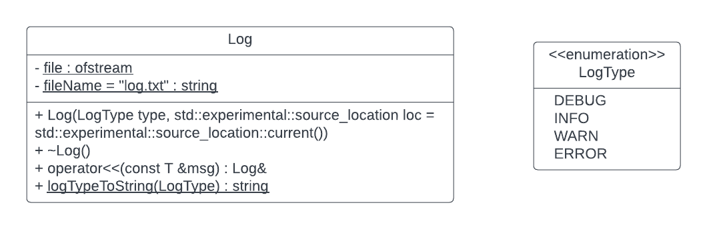

# Task 11.2 (optional)

Take Task 11.1.

Sometimes when the code is in production, we want to be able to log any possible errors in a
file ([log file](https://en.wikipedia.org/wiki/Logging_(software))) . We will make a class `Log` for this purpose. C++20
is required for this assignment.



Example:

```c++
#include "SensorHub.h"
#include "Log.h"

int main() {
    Log(LogType::INFO) << "This is additional message. We can also put multiple << and other types, not just strings e.g. " << 5 << "\n" ;

    SensorHub hub;
    hub.loadSensorsFromFile("../sensors.txt");
    hub.readValues();
    return 0;
}
```

Inside of `log.txt`:

```asm
05/15/23 13:25:39 INFO [main#5] This is additional message. We can also put multiple << and other types, not just strings e.g. 5
05/15/23 13:25:39 ERROR [loadSensorsFromFile#61] Sensor with id 12 already exists!
```

1. Write a `Log` class with the following requirements:
    * Inside the constructor open the file and write log information - when (date and time), log type, and
      where ([function#line]). For the time of the event, use [std::chrono::
      system_clock](https://en.cppreference.com/w/cpp/chrono/system_clock). For the line where the error occurred
      with [std::experimental::source_location](https://en.cppreference.com/w/cpp/experimental/source_location).
    * A destructor that closes a file.
    * Override the `<<` operator - `Log &operator<<(const T &msg)`. Please be aware that we can receive
      messages of any type (so it is a template). Inside this method, we write the received message to a file. At the
      end, we return itself (the object).

3. In the `loadSensorsFromFile` method inside the `try-catch` block, add an error log to the file in case a sensor with
   ID exists.

4. Create another exception to your choice. The example should make sense.

5. Find three more examples of `LogType` to write `[WARN]` to the file.

6. Demonstrate the `Log` class and exceptions.